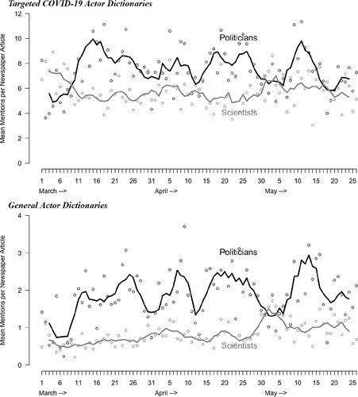
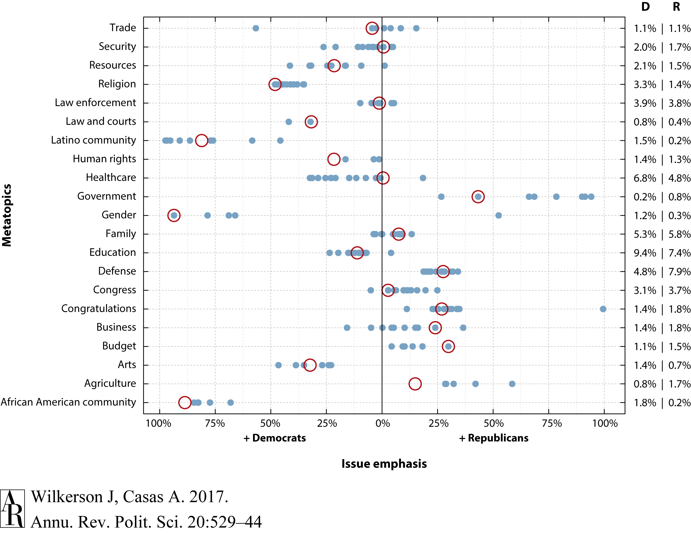
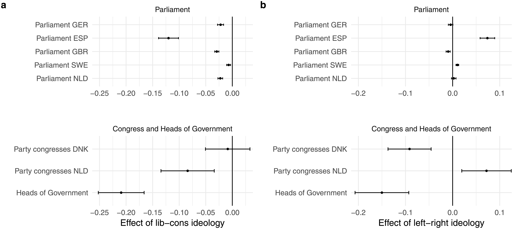
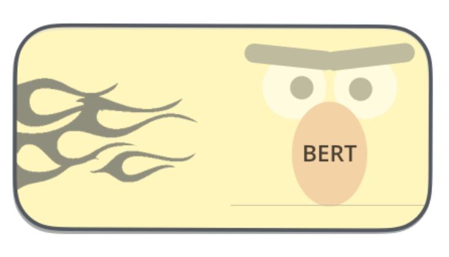

```{r setup, include=FALSE}
knitr::opts_chunk$set(message = FALSE)
knitr::opts_chunk$set(warning = FALSE)
library(tidyverse)
library(tidytext)
library(readtext)
library(quanteda)
theme_set(theme_minimal())
```

# Goals for Today
## Goals

- Evaluation
- Final Project
- Transformer Architecture
- Wrap Up

# Evaluation
## Course Evaluation

- Please take up to 15 minutes to fill out the course evaluation survey. You can access the evaluations by going to [MyStudies](https://staff.hertie-school.org/maportal/hcmLogon) and clicking on the _Evaluations_ tab. 

# Final Project

## Final Project: Example 1 - Dictionaries and Scaling

- [Hart, PS, Sedona Chinn, and Stuart Soroka. 2020. "Politicization and Polarization in COVID-19 News Coverage". _Science Communication 42(5):679-697_](https://journals.sagepub.com/doi/full/10.1177/1075547020950735)

- How politicized and polarized are COVID-19 news in U.S. newspapers and televised network news?

## Final Project: Example 1 - Dictionaries and Scaling

- Research Design: 

    1. Using Lexis-Nexis, collected news broadcasts from ABC, CBS, and NBC and front-section stories from six regional and national newspapers from Jan - May 2020.
    2. Used a dictionary to identify articles and broadcasts about COVID-19
    3. Contructed two dictionaries: one with mentions of political actors to measure politicization and one with mentions of scientists to measure scientific coverage
    4. Extracted 200-word “windows” from COVID-19 articles that mention Republicans or Democrats (but not both) and then used _wordfish_ to measure polarization

## Final Project: Example 1 - Dictionaries and Scaling

```{r, out.width = "500px", echo = F}

``` 
    
## Final Project: Example 2 - Topic Model

- [Wilkerson, John & Andreu Casas. 2017. "Large-Scale Computerized Text Analysis in Political Science: Opportunities and Challenges". _Annual Review of Political Science_](https://www.annualreviews.org/doi/10.1146/annurev-polisci-052615-025542)

- What topics are covered and which are the most common in US House of Representative floor speeches? Do Republicans and Democrats tend to talk about the same issues or emphasize different ones?


## Final Project: Example 2 - Topic Model

- Research Design: 

    1. Downloaded all member statements from the 113th US Congress using the [Sunlight Foundation's Capitol Words API](https://sunlightlabs.github.io/Capitol-Words/)
    2. Removed statements that did not begin with the opening phrase of a one-minute speech: “Mr. Speaker, I rise today.…” 
    3. Preprocessing
    4. Ran 17 different versions of an LDA topic model, ranging from 10 to 90 topics and clustered all 850 into 50 topics metatopics
    5. Assign a topic to each speech and plot the issue emphasis between D & R

## Final Project: Example 2 - Topic Model

```{r, out.width = "700px", echo = F}

``` 

## Final Project: Example 3 - Linguistic Complexity

- [Schoonvelde, Martijn, Anna Brosius, Gijs Schumacher, & Bert N Bakker. 2019. "Liberals lecture, conservatives communicate: Analyzing complexity and ideology in 381,609 political speeches". _PLoS ONE 14(2)_](https://journals.plos.org/plosone/article?id=10.1371/journal.pone.0208450)

- Do liberal politicians use more complex language than conservative politicians?

## Final Project: Example 3 - Linguistic Complexity

- Research Design: 

    1. Created a corpus of three speech datasets: ParlSpeech, EUSpeech, and a dataset of party congress speeches collected from [Harvard's Dataverse](https://dataverse.harvard.edu/dataset.xhtml?persistentId=doi:10.7910/DVN/S4IZ8K)
    2. Created a measure of linguistic complexity, measured as an index of the average number of words per sentence and the average word length
    3. Measured complexity of each speech and investigated distributions and trends over time
    4. Regressed speech complexity ideology (taken from the Manifesto Project DB), on OLS regression for each corpora

## Final Project: Example 3 - Linguistic Complexity

```{r, out.width = "700px", echo = F}

``` 

    
## Final Project Submission

- You have two options: 

    1. Do a replication of either the Hart et al. study (Dictionary/Scaling), the Wilkerson & Casas paper (Topic Model), or the Schoonvelde et.al article (Linguistic Complexity). If you choose the first paper, you can also focus on different news outlets depending on what you can get from Lexis-Nexis.
    2. Do your own project.

- Deadline: December 17, 2021.

- Form: RMarkdown file and audio or video file of your recording.

# Transformer Architecture

## A new generation of NLP 

- Our understanding of how best to represent words and sentences in a way that best captures underlying meanings and relationships is rapidly evolving. 

- One of the latest milestones in this development is the release of BERT in 2018, an event described as marking the beginning of a new era in NLP.

```{r, out.width = "400px", echo = F}

``` 

## BERT: Transformer Architecture

- BERT is a Transformer language model with variable number of encoder layers and self-attention heads that help the encoder look at other words in the input sentence as it encodes a specific word.

- BERT takes a sequence of words as input which keep flowing up the stack. Each layer applies self-attention, and passes its results through a feed-forward network, and then hands it off to the next encoder.

- BERT can take as input either one or two sentences, and uses the special token [SEP] to differentiate them. The [CLS] token always appears at the start of the text, and is specific to classification tasks.

## BERT: Transformer Architecture

```{r, out.width = "700px", echo = F}
knitr::include_graphics("img/bert-output-vector.png")
```

## BERT: Two-Step Development

- BERT was pretrained on two tasks: language modelling (15% of tokens were masked and BERT was trained to predict them from context) and next sentence prediction using data from Wikipedia and Brown Corpus containing text samples of American English

- The pre-trained model can fine-tuned to a specific task with a labelled dataset

-  The output from the BERT model, so called context-dependent embeddings can be used for other downstream tasks

## BERT: Transfer Learning

```{r, out.width = "700px", echo = F}
knitr::include_graphics("img/bert-transfer-learning.png")
```

## BERT: Sentence Classification

- You can use BERT to classify a single piece of text, such as an email. All you have to do is to train the classifier on your specific task, which is also called fine-tuning.

```{r, out.width = "700px", echo = F}
knitr::include_graphics("img/BERT-classification-spam.png")
```

## BERT: Other Downstream Tasks

- BERT can be used for various classification tasks like sentiment analysis, summarization, named entity recognition, question answering, measuring topic similarity, and doing topic modelling.

- In fact, Google now uses BERT on almost every Query done on Google Search

## BERT in R

- BERT was developed for Python. If you want to use it in R, then you can install `RBERT` from Github

```{r, eval = FALSE}
remotes::install_github("jonathanbratt/RBERT")
```

- `RBERT` requires Tensorflow package to be installed on your machine. You can install it using the `tensorflow` package.

```{r, eval= FALSE}
tensorflow::install_tensorflow(version = "1.13.1")
```


## RBERT

- RBERT is in active development and can currently be used to:

    1. Using the output of a pre-trained BERT model as features for downstream model
    2. Fine-tuning on top of a pre-trained BERT model (speed may be an issue)

- You currently cannot train a BERT model from scratch

- We won't be able to go over how to use BERT in R, but please check out the [vignette](https://github.com/jonathanbratt/RBERT/blob/master/vignettes/RBERT_intro.Rmd) if you are interested.

## GPT-3

- Open AI developed a language model called GPT-3 that based on a similar transformer architecture as BERT but is extremely powerful at completion and text generation tasks.

```{r, out.width = "700px", echo = F}
knitr::include_graphics("img/05-gpt3-generate-output-context-window.gif")
```

## GPT-3

- You can sign up for a free developer account [here](https://beta.openai.com/) and test it out yourself.

- Let's jump right into the [playground](https://beta.openai.com/playground)

# Wrapping up

## Text-as-Data Wrap up

- Text is one more the most important data sources in political science as it conveys important information about political preferences and behaviors
- There are a lot of different ways to turn text into data
- Regardless of the type of text analysis, you usually follow certain preprocessing steps
- `quanteda` is the de facto standard for working with text in R
- For more advanced natural language processing you eventually need to learn some python
- There are very powerful language models like BERT or GPT-3 that much more accurate results for various downstream tasks like sentiment analysis or topic modelling


## This concludes the class

Thanks you so much for choosing to enroll in this class and for your great participation and feedback.
