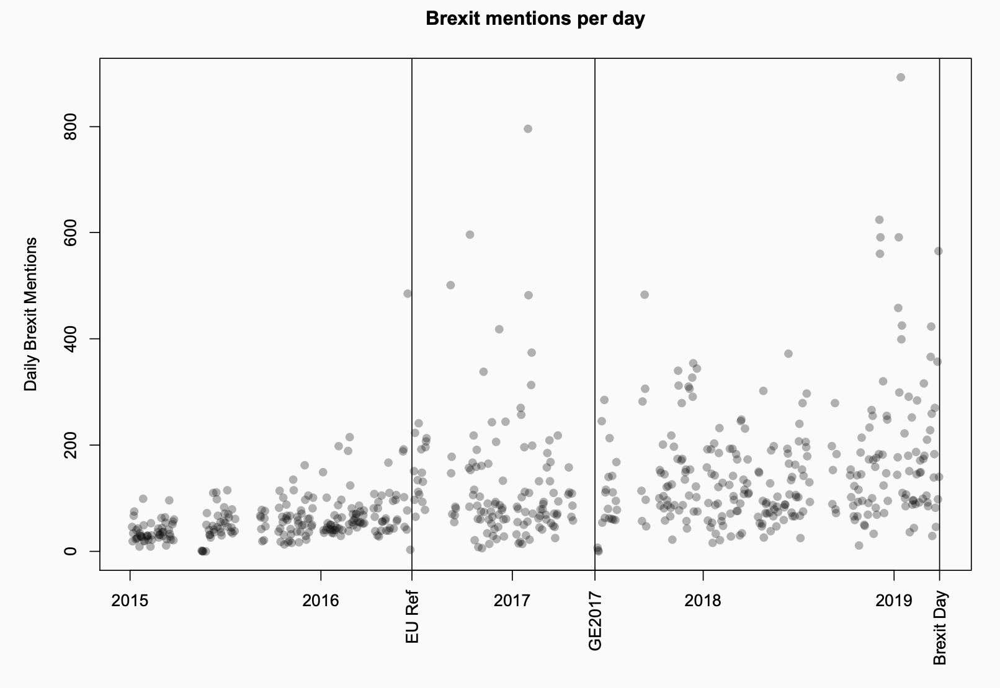

```{r setup, include=FALSE}
knitr::opts_chunk$set(message = FALSE)
knitr::opts_chunk$set(warning = FALSE)
library(tidyverse)
library(readtext)
library(quanteda)
theme_set(theme_minimal())
```

# Goals for Today

## Goals

- Dictionary approaches
- Dictionaries in quanteda 
- Sentiment analysis

# Dictionary approaches

## Dictionary approaches

- Dictionaries help classifying texts to categories or determine their content of a known concept
- They are a hybrid  between qualitative and quantitative classification.
- Dictionary construction involves a lot of contextual interpretation and qualitative judgment.
  
    - Which text pertain to which categories?
    - Which texts contain how much of a concept?
    
- Dictionaries are perfectly reliable because there is no human decision making as part of the text analysis procedure


## Dictionary approaches

- Rather than count words that occur, pre-define words associated with specific meanings
- Dictionaries consist of keys and values, where the "key" is a category such as "positive" or "negative", and the "values" consist of the patterns assigned to each key that will be counted as occurrences of those keys 
- Dictionaries often require lemmatization rather than stemming

## Dictionary approaches

- A dictionary is basically just a list of words that is related to a common concept
- Applying them to a corpus of texts simply requires counting the number of times each word in the list occurs in each text and summing them

## Advantages of dictionaries: Implementations

- There are many different implementations of dictionaries for all types of contexts
- Take for example the Linquistic Inquiry and Word Count project craeted by Pennebaker et al: http://www.liwc.net
- Consists of about 4,500 words and word stems, each defining one or more word categories or sub-dictionaries
- For example, the word _cried_ is part of five word categories: sadness, negative emotion, overall affect, verb, and past tense verb
- Hierarchical: so "anger" are part of an emotion category and a negative emotion subcategory
- You can buy it here: https://liwcsoftware.onfastspring.com/

##  Example 1: Terrorist speech

An analysis of terrorist speech (Pennebaker & Chung 2009)

```{r, out.width = "600px", echo = F}
knitr::include_graphics("img/10-1.png")
```  

## Examples 2: Happiness in song lyrics

Valence time series for song titles broken down by representative genres (Dodds & Danforth 2009)

```{r, out.width = "700px", echo = F}
knitr::include_graphics("img/10-2.png")
```  

## Examples 3: Happiness in blogs

Time series of average monthly valence for blog sentences starting with "I feel…" (Dodds & Danforth 2009)

```{r, out.width = "700px", echo = F}
knitr::include_graphics("img/10-3.png")
```  

## Advantages of dictionaries: Multi-lingual

Dictionaries exist for lots of different languages.

```{r, out.width = "600px", echo = F}
knitr::include_graphics("img/10-4.png")
```  

## Advantages of dictionaries: Fast to apply

Dictionaries can by easily applied to thousands of texts in a matter of seconds allowing us to quickly analyze texts

```{r, out.width = "700px", echo = F}

```  

## Diadvantage: Highly specific to context

- Dictionaries have problems with words that are polysemes i.e. words that have multiple meanings in different contexts
- Dictionaries might miss words that are important to the concept or the tone of a document
- They do not typically capture modifiers (e.g. "not good")
- They often fail to capture synonyms

## Creating dictionaries 

- Collect the words that discriminate between categories/concepts, i.e. create a dictionary

    + Existing dictionaries
    + Creating a dictionary

- Quantify the occurrence of these words in texts
- Validate
- Be careful: Applying dictionaries outside the domain for which they were developed can lead to errors


# Dictionaries in quanteda

## Creating a simple dictionary

To create a simple dictionary of parts of speech, for instance we could define a dictionary consisting of articles and conjunctions, using:

```{r}
pos_dict <- dictionary(list(articles = c("the", "a", "and"),
           conjunctions = c("and", "but", "or", "nor", "for", "yet", "so")))
```

## Creating a simple dictionary

We can use this dictionary when we create a `dfm` to let this define a set of features:

```{r}
pos_dfm <- data_corpus_inaugural %>% 
  tokens(remove_punct = TRUE, remove_numbers = TRUE) %>% 
  dfm() %>% 
  dfm_lookup(pos_dict)
```

## Creating a simple dictionary

Let's recreate the dfm but weight it by document length and compute the share of of articles and conjunctions in each speech:

```{r}
pos_dfm_wgt <- data_corpus_inaugural %>% 
  tokens(remove_punct = TRUE, remove_numbers = TRUE) %>% 
  dfm() %>% 
  dfm_weight(scheme = "prop") %>% 
  dfm_lookup(pos_dict)
```
## Creating a simple dictionary

Let's plot the trends over time. Before we can do that we need to convert the dfm to a data frame and tidy it up a bit.

```{r, eval = FALSE}
pos_df_wgt <- pos_dfm_wgt %>% 
  convert(to = "data.frame") %>% 
  cbind(docvars(pos_dfm_wgt)) %>% 
  tidyr::gather(pos, share, articles:conjunctions)

pos_df_wgt %>% 
ggplot(aes(x = Year, y = share, color = pos)) +
  geom_line() +
  ylab("Share of Document") +
  theme(legend.title = element_blank())
```

## Creating a simple dictionary

```{r, echo = FALSE}
pos_df_wgt <- pos_dfm_wgt %>% 
  convert(to = "data.frame") %>% 
  cbind(docvars(pos_dfm_wgt)) %>% 
  tidyr::gather(pos, share, articles:conjunctions)

pos_df_wgt %>% 
ggplot(aes(x = Year, y = share, color = pos)) +
  geom_line() +
  ylab("Share of Document")  +
  theme(legend.title = element_blank())
```

## Exercise

Create a new dictionary with a concept of your own choosing and apply it to the inaugural speeches. Plot the prevalence of that concept in the speeches (e.g. over time or between different speakers). Paste your results into the chat.

Take about 10-15 minutes.

# Sentiment analysis

## Sentiment analysis with quanteda

Perhaps the most popular type of dictionary are sentiment dictionaries used to assess the valence of a text by searching for words that describe opinions.

There is a new, still somewhat experimental, quanteda package called `quanteda.sentiment` that extends the quanteda package with functions for computing sentiment on text. You need to install it directly from github

```{r}
#devtools::install_github("quanteda/quanteda.sentiment")
library(quanteda.sentiment)
```

## `quanteda.sentiment`

`quanteda.sentiment` has two main functions: `textstat_polarity()` to compute _polarity-based sentiments_ (i.e. polar opposites such as republican vs. democrat or negative vs. positive) and `textstat_valence()` to compute _valence-based sentiments_ for continuous degrees of sentiments.

The package comes with the following built-in dictionaries:

| Name                             | Description                                                   | Polarity | Valence |
|:---------------------------------|:--------------------------------------------------------------|:--------:|:-------:|
| data_dictionary_AFINN            | Nielsen's (2011) 'new ANEW' valenced word list                |          |    ✔    |
| data_dictionary_ANEW             | Affective Norms for English Words (ANEW)                      |          |    ✔    |
| data_dictionary_geninqposneg     | Augmented General Inquirer _Positiv_ and _Negativ_ dictionary |     ✔    |         |
| data_dictionary_HuLiu            | Positive and negative words from Hu and Liu (2004)            |     ✔    |         |
| data_dictionary_LoughranMcDonald | Loughran and McDonald Sentiment Word Lists                    |     ✔    |         |
| data_dictionary_LSD2015          | Lexicoder Sentiment Dictionary (2015)                         |     ✔    |         |
| data_dictionary_NRC              | NRC Word-Emotion Association Lexicon                          |     ✔    |         |
| data_dictionary_Rauh             | Rauh's German Political Sentiment Dictionary                  |     ✔    |         |
| data_dictionary_sentiws          | SentimentWortschatz (SentiWS)                                 |     ✔    |    ✔    |

## Exploring built-in dictionaries

You can view the content of those dictionaries by using the `print()` function:

```{r}
print(data_dictionary_geninqposneg, max_nval = 5)
```

## Applying a polarity-based sentiment dictionary

To compute the polarity-based sentiment scores for the most recent inaugural speeches we can simply apply the `textstat_polarity()`function to our corpus and specify the dictionary we wish to use.

```{r}
data(data_corpus_inaugural, package = "quanteda")
sent_pres <- data_corpus_inaugural %>%
  corpus_subset(Year > 1980) %>% 
  textstat_polarity(dictionary = data_dictionary_LSD2015)
tail(sent_pres)
```

## Applying a polarity-based sentiment dictionary

Of course we could then also plot the results

```{r}
sent_pres %>% 
  ggplot(aes(x = sentiment, y = reorder(doc_id, sentiment))) +
    geom_point() +
    ylab("")
```

## Applying a valence-based sentiment dictionary

If we want to apply a valence-based dictionary instead we would use the `textstat_valence()` function. For example to 
compute the valence scores using  Nielsen’s (2011) ‘new ANEW’ valenced word list:

```{r}
tail(data_corpus_inaugural) %>%
  textstat_valence(dictionary = data_dictionary_AFINN)
```

## Exercise

Install the package `quanteda.corpora` from github using the `install_github` function from the `devtools`or `remotes` package:

```{r, eval=FALSE}
#remotes::install_github("quanteda/quanteda.corpora")
library(quanteda.corpora)
```

Download the corpus of 6,000 Guardian news articles using `download("data_corpus_guardian")` and create a plot showing how the sentiment score has changed over time. Paste your results into the chat.

Take about 10-15 Minutes.`


# Wrapping up

## Questions?

## Outlook for our next session

Next week we will continue our session on text classification by looking into scaling methods

## That's it for today

Thanks for your attention!
